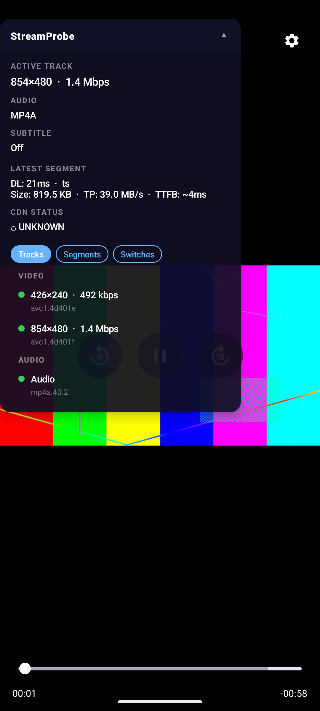
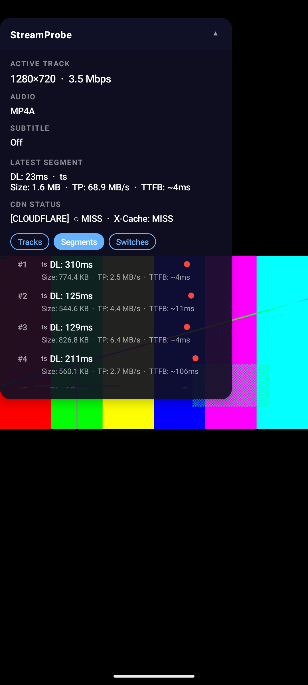
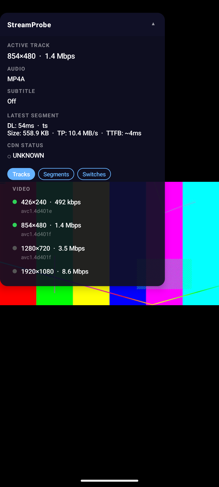
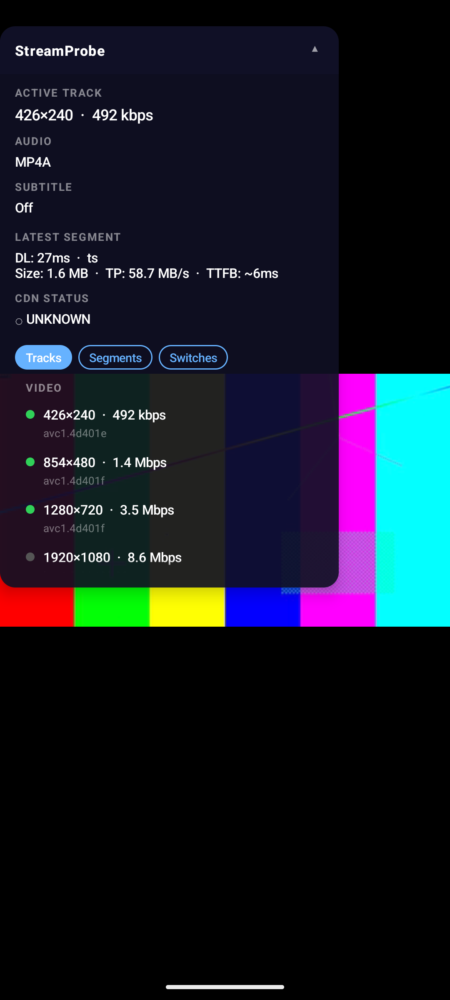

# The symptom lies: diagnosing five identical-looking streaming faults

> Draft for an external post (Medium / LinkedIn). Source lives in the repo at
> `tools/fault-deck/case-study/`. Every screenshot and terminal block below is a
> real, unedited capture from the rig — no doctored numbers. The *faults*, by
> contrast, are deliberately injected so the ground truth is known: the throttle
> is a real byte-rate cap, and the CDN case stamps synthetic `MISS` cache headers
> (there's no real CDN in the loop). That's the test bench, not a sleight of hand.
> The new EventLogger logcat dumps and the mitmproxy header capture are held to
> the same standard — every one is a real `adb logcat -s EventLogger` or
> `mitmdump` capture from the rig, reproducible with the scripts in
> `tools/fault-deck/` (`capture-eventlogger.sh` and the documented `mitmdump`
> invocation).

A user reports: *"the video is playing at low quality."*

That one sentence is the entire bug report you get in the real world. And it is almost useless, because at least five completely different root causes produce exactly that symptom:

- the stream's manifest was trimmed and the high rungs were never offered;
- the network link genuinely can't sustain the top rung;
- the CDN is missing cache on every segment;
- the player is hard-capped to a low resolution by its own configuration;
- the player's ABR is mistuned and refuses to climb even though it could.

Same video, same blurry picture. Five different fixes, owned by four different teams (encoding, networking, CDN, client). Picking the wrong one costs days.

This is a walkthrough of how long it takes to tell these apart **with the strongest raw baseline a video engineer actually uses** — not a strawman of `curl` and `adb logcat`, but those *plus* ExoPlayer's own [`EventLogger`](https://developer.android.com/media/media3/exoplayer/debug-logging) (an `AnalyticsListener` that logs the runtime ladder and the player's track-selection state) and a proxy (mitmproxy) for real CDN headers — versus **with an in-player diagnostics overlay** ([StreamProbe](https://github.com/oguzhaneksi/StreamProbe)).

I'll make **two claims, at two altitudes**, because the same overlay advantages land very differently depending on who's reading:

- **For the ExoPlayer engineer — the modest, defensible claim.** EventLogger + mitmproxy can reconstruct *most* of the state the overlay shows. The overlay's real advantage is not "raw tools can't see it." It's that the overlay surfaces that state **(a) on-device, (b) live and visual, colocated with the playback it describes, (c) without adb, a debugger, or a logcat firehose, and (d) while prompting which question to ask.** A smaller claim — but one an engineer can't wave away. (This is also the honest answer to the first objection any ExoPlayer dev will raise: *"where's EventLogger?"* It's right here, in the raw arm, and the overlay still wins.)
- **For QA, triage, and support — where the claim gets its teeth.** For them the raw arm **doesn't exist.** EventLogger needs source access, a wired debug build, a connected device + adb, and the fluency to read a logcat firehose; mitmproxy needs a proxy setup and HTTP/cache-header knowledge. A QA tester has none of these. So the raw arm collapses to *"you can't — escalate to an engineer,"* and the overlay becomes the difference between a useless *"video is low quality"* ticket and one **routed to the right team on the first try**. That *"five different fixes, owned by four different teams"* line above isn't an engineer story — it's a routing story.

The engineer comparison buys credibility (I didn't cheat the baseline). The QA lens is where the dollars are: a misrouted bug bounces between encoding, networking, CDN, and client teams for days. Both claims run through every case below.

## The setup

To make this reproducible and not hand-wavy, every case below runs against a controlled rig:

- One real HLS ladder — 240p / 480p / 720p (AVC) + 1080p (HEVC) — encoded once.
- An nginx server that exposes the *same* ladder under several profiles: the full manifest, a manifest trimmed to 480p, a byte-rate-throttled path, and a path that stamps fake `X-Cache: MISS` headers on every response.
- An Android demo app that plays a given URL and can mistune its own ExoPlayer track selector on command.

So each "fault" is a known, injected condition. We know the right answer — the question is how fast each approach *gets* to it. (The rig is in the repo if you want to run it yourself.)

The whole point: in all five cases below, the picture on screen looks the same — low quality. Everything that follows is about telling them apart.

## Methodology

A few words on how this was run, so the comparison is fair rather than rigged:

- **Who:** one engineer familiar with HLS/ABR, comfortable with `curl`, `adb`, EventLogger, and mitmproxy — so the raw-tools arm is the *strongest in-player baseline*, not a strawman who doesn't know where to look. Crucially, this is the **engineer's** arm: a QA tester or support agent has none of these tools, so for them the raw arm is unavailable and the comparison is "overlay vs escalate."
- **Tools allowed in the raw arm:** the video itself, `curl`, `adb logcat`, **ExoPlayer's `EventLogger`** (`AnalyticsListener`), and **mitmproxy** for CDN headers. Source-code access only for the two configuration faults, where reading the player setup is the only raw path to the *why*.
- **Tools in the overlay arm:** the StreamProbe overlay only, attached to the same player playing the same URL.
- **What was measured:** per fault — the number of distinct tools touched, the number of commands/actions, the number of context switches (app ↔ terminal ↔ editor), and an approximate wall-clock time *for the engineer*. Separately, per fault: whether the raw arm is **reachable at all for a QA tester**. Time is a range, not a stopwatch figure; it varies too much by operator.
- **Ground truth:** each fault is an injected condition with a known cause, revealed only *after* the diagnosis was written down, so the raw arm couldn't shortcut to the answer.
- **Real captures:** every EventLogger and mitmproxy block below is a real capture from the rig (see the scripts in `tools/fault-deck/`), held to the same no-doctored-numbers promise as the screenshots.

---

## Case 1 — `manifest_cap`: the cause is in the manifest, not the network

**Symptom:** video tops out at 480p and never climbs.

### Without the tool

Your first instinct is "slow network." But before chasing that, you check the stream itself — you pull the manifest the player was actually served:

```text
$ curl -s http://localhost:8080/cap480/master.m3u8     # what the player was served
#EXTM3U
#EXT-X-VERSION:7
#EXT-X-STREAM-INF:BANDWIDTH=492000,RESOLUTION=426x240,CODECS="avc1.4d401e,mp4a.40.2"
240p/index.m3u8
#EXT-X-STREAM-INF:BANDWIDTH=1380000,RESOLUTION=854x480,CODECS="avc1.4d401f,mp4a.40.2"
480p/index.m3u8

$ curl -s http://localhost:8080/full/master.m3u8       # what the source actually has
...
#EXT-X-STREAM-INF:BANDWIDTH=3510000,RESOLUTION=1280x720,...
720p/index.m3u8
#EXT-X-STREAM-INF:BANDWIDTH=8560000,RESOLUTION=1920x1080,CODECS="hvc1.2.4.L120.90,..."
1080p/index.m3u8
```

The served manifest lists only 240p and 480p. The 720p and 1080p rungs exist at the source but were never advertised. **The cap is in the manifest, not the network.**

That's the right answer — but getting there meant: knowing to suspect the stream, finding the manifest URL, `curl`-ing it, reading `EXT-X-STREAM-INF` lines, and ideally comparing against an unfiltered reference to be sure rungs are *missing* rather than simply absent.

A competent ExoPlayer dev wouldn't stop at `curl`, though — they'd attach `EventLogger` and read the ladder the player itself parsed. The `Tracks` dump confirms the runtime ladder caps at 480p — only two video rungs are present, both `supported=YES`, nothing above 480p — the manifest cap, now from inside the player:

```text
$ adb logcat -s EventLogger        # trimmed to the video Tracks group
D EventLogger: tracks [eventTime=0.36, mediaPos=0.00, window=0, period=0
D EventLogger:   group [ id=main
D EventLogger:     [X] Track:0, id=null, mimeType=video/avc, container=application/x-mpegURL, bitrate=492000, codecs=avc1.4d401e, res=426x240, supported=YES
D EventLogger:     [X] Track:1, id=null, mimeType=video/avc, container=application/x-mpegURL, bitrate=1380000, codecs=avc1.4d401f, res=854x480, supported=YES
D EventLogger:   ]
D EventLogger: ]
```

So even the *strongest* raw baseline gets the engineer to the ladder — EventLogger's `Tracks` dump already says "cap is in the manifest." But one honest caveat, because it recurs below: **In these captures, EventLogger gave me the ladder and selected-format state, but not the per-segment network evidence I needed for the diagnosis; that still came from curl/proxy timing.** The "link is fast" half of the diagnosis still comes from the `curl` timing, not the logger — so the raw arm needs *two* tools for the two facts the overlay shows in one place. The overlay's win therefore narrows from "invisible state" to **live, visual, on-device, colocated**: the runtime ladder *and* the throughput side by side, without attaching a logger, filtering logcat, or running a second tool.

**The QA lens:** none of that is available to a tester. They can't attach EventLogger (no source, no debug build, no adb), can't read the dump if they could. Without the overlay their bug report is *"it's blurry."* With it, it's *"the ladder caps at 480p"* — a report that routes straight to the encoding/packaging team instead of bouncing through networking first.

### With StreamProbe



The Tracks tab lists the runtime ladder — every rung the player actually knows about: **426×240 and 854×480, and nothing above.** The header shows throughput at **39 MB/s** (`TP: 39.0 MB/s`), so the link is plainly fast. A runtime ladder that stops at 480p next to high throughput points at the manifest, not the network — both facts colocated in the player-visible state, no external lookup required.

**Difference (engineer):** EventLogger reconstructs the ladder (but not the throughput — that's a separate `curl`), and it takes attaching a logger and reading a logcat dump; the overlay shows the ladder *and* throughput together, live, on-device, next to the video. **Difference (QA):** EventLogger isn't an option at all — the overlay is the only thing that turns "blurry" into a correctly-routed ticket.

---

## Case 2 — `network_throttle`: the cause genuinely *is* the network

**Symptom:** identical. Video tops out below the ceiling and never climbs. This is the deliberate inverse of Case 1.

### Without the tool

The manifest checks out this time (full ladder present), so you measure the link by fetching the same segment over the real path and an unthrottled reference:

```text
$ curl -o /dev/null -s -w '%{speed_download} B/s  in %{time_total}s\n' \
    http://localhost:8080/full/720p/seg_001.ts
64482208 B/s  in 0.020572s        # ~64 MB/s on the unthrottled path

$ curl -o /dev/null -s -w '%{speed_download} B/s  in %{time_total}s\n' \
    http://localhost:8080/throttle/720p/seg_001.ts
654261 B/s  in 2.027521s          # ~654 KB/s on the throttled path
```

Same segment, ~100× slower on the real path — 2 seconds instead of 20 milliseconds. **The link is the bottleneck**, so ABR is correctly sitting below the top rung. Right answer again, but it took knowing which segment to fetch, fetching from two paths, and reasoning about whether the measured rate sustains the target bitrate.

And again, the engineer's real baseline is EventLogger. The `Tracks` dump shows the **full ladder present** — 240p/480p/720p all selectable (`[X]`), nothing missing unlike Case 1 — yet the player's `downstreamFormat` is parked at **480p**: so this isn't a cap, the player simply isn't climbing. That contrast — full ladder, but sitting low — is the tell, from inside the player:

```text
$ adb logcat -s EventLogger        # trimmed to the Tracks group + the rung actually playing
D EventLogger: tracks [eventTime=0.27, mediaPos=0.00, window=0, period=0
D EventLogger:   group [ id=main
D EventLogger:     [X] Track:0, id=null, mimeType=video/avc, container=application/x-mpegURL, bitrate=492000, codecs=avc1.4d401e, res=426x240, supported=YES
D EventLogger:     [X] Track:1, id=null, mimeType=video/avc, container=application/x-mpegURL, bitrate=1380000, codecs=avc1.4d401f, res=854x480, supported=YES
D EventLogger:     [X] Track:2, id=null, mimeType=video/avc, container=application/x-mpegURL, bitrate=3510000, codecs=avc1.4d401f, res=1280x720, supported=YES
D EventLogger:     [ ] Track:3, id=null, mimeType=video/hevc, container=application/x-mpegURL, bitrate=8560000, codecs=hvc1.2.4.L120.90, res=1920x1080, supported=NO_EXCEEDS_CAPABILITIES
D EventLogger:   ]
D EventLogger: ]
D EventLogger: downstreamFormat [eventTime=0.37, mediaPos=0.00, window=0, period=0, id=null, mimeType=null, container=application/x-mpegURL, bitrate=1380000, codecs=avc1.4d401f,mp4a.40.2, res=854x480]
```

*(This EventLogger dump and the overlay screenshot above were captured at slightly different byte-rate caps — the overlay run let ABR hover toward 720p, this tighter run pins it at 480p — but both show the same diagnosis: full ladder present, player held below the top by the link.)*

So the raw arm reconstructs the *shape* — full ladder, player parked at 480p — but here's the same caveat as Case 1, sharper: **EventLogger logs no per-segment download time and no bandwidth estimate** (there is no `loadCompleted` timing in its output). The proof that the *link* is the bottleneck still comes from the `curl` measurement above, not the logger. The overlay collapses both into one view: it surfaces the per-segment download time (**`DL: 2031 ms`**) **live and visual**, next to the ladder, with no second tool and no logcat correlation.

**The QA lens:** a tester sees the *exact same blurry video* as Case 1 and has no way to tell the two apart — both are "low quality." EventLogger would separate them, but it's out of reach. With the overlay, their report flips from "blurry" to *"every segment takes ~2 s to load"* — which routes to networking, not encoding. That single distinction is the difference between Case 1 and Case 2 being filed against the right team.

### With StreamProbe


Same Tracks tab, opposite story. The full ladder is present — **720p sits in the selected pool (green), 1080p greyed as undecodable HEVC on this device** — but look at the latest segment: **`DL: 2031 ms`** for a single chunk, at **`TP: 927.5 KB/s`**. That's the same two-seconds-per-segment the `curl` measured, surfaced live in the player. The top decodable rung is 720p (~440 KB/s raw), but ABR's safety margin wants headroom above that, and the throttle pins throughput right around that threshold with ~2 s segment loads — so ABR wobbles between 480p and 720p. The rungs exist; the link can't comfortably feed the top one. The exact inverse of Case 1, where the rungs were missing and the link was fast.

> Throughput is the noisier signal here: the player opens parallel connections, so the headline rate wobbles run to run (~0.65–1.3 MB/s). The robust tell is the **download time per segment** — one to two seconds, versus ~20 ms unthrottled — which is precisely what the `curl` timing showed.

**Difference (engineer):** EventLogger shows the full ladder and that the player is parked at 480p — but *not* the per-segment timing that proves it's the link (that's a separate `curl`); the overlay shows the download-time-per-segment live as each chunk lands. **Difference (QA):** unavailable raw — the overlay is what makes "blurry" into "segments crawl," routed to networking.

---

## Case 3 — `cdn_miss`: quality is fine; the problem is the CDN

**Symptom:** the trickiest of the set, because the rendered quality is actually *fine*. Users almost never report "my CDN cache is cold" — they report the *experience* ("it's laggy," "it keeps buffering," "the quality is bad"), so a cache problem reaches you disguised as a quality complaint. The picture looks okay, yet playback feels heavier than it should and nothing in the manifest or the bitrate explains why.

### Without the tool

There's nothing to see in the manifest or in throughput, and here EventLogger doesn't help either: it logs the ladder and playback state, not cache headers. So the engineer reaches for a proxy. A single `curl -I` is misleading — it's a separate request on a fresh connection with no ABR, so it doesn't represent the player's real segment traffic. mitmproxy does: it sits in front of nginx and captures the cache header on *every* segment the player actually fetches.

```text
$ mitmdump --mode reverse:http://localhost:8080 -p 8081 --flow-detail 2   # trimmed to GET + cache headers
GET http://localhost:8080/cdnmiss/480p/seg_000.ts
 << 200 OK 756k
    X-Cache: MISS
    CF-Cache-Status: MISS
GET http://localhost:8080/cdnmiss/480p/seg_001.ts
 << 200 OK 532k
    X-Cache: MISS
    CF-Cache-Status: MISS
GET http://localhost:8080/cdnmiss/720p/seg_005.ts
 << 200 OK 1.2m
    X-Cache: MISS
    CF-Cache-Status: MISS
GET http://localhost:8080/cdnmiss/720p/seg_006.ts
 << 200 OK 1.8m
    X-Cache: MISS
    CF-Cache-Status: MISS
```

Every segment is a cache **MISS** — each goes all the way to origin instead of being served from the edge. Quality is unaffected, but every segment pays origin latency. The proxy gives the engineer the *faithful* picture a `curl -I` can't — but notice what it doesn't give: **the idea to look at the CDN in the first place.** Neither EventLogger nor mitmproxy prompts that hypothesis. You have to already suspect the CDN, set up the proxy, route the device through it, and recognize cache-status header names across vendors. If the hypothesis never occurs, the proxy never gets started.

### With StreamProbe



The header says it outright — **`CDN STATUS: [CLOUDFLARE] ○ MISS · X-Cache: MISS`** — and the Segments tab flags **every segment with a red MISS dot** while throughput stays high (2–6 MB/s per segment). Quality is fine; the cache is the story. The overlay parses the cache headers for you, across vendors, with no guessing which header to look for.

**Difference (engineer):** mitmproxy gives a faithful per-segment header capture, but only *after* you suspect the CDN, stand up a proxy, and route traffic through it; the overlay's red MISS dot is on-screen the whole time and **prompts the hypothesis you'd otherwise have to think of first.** **Difference (QA):** this is the overlay's strongest case. A tester would never reach a proxy — without the overlay this fault is invisible to triage and gets misrouted as a vague "buffering" complaint that bounces for days. The overlay turns it into *"every segment is a cache MISS,"* routed straight to the CDN team.

---

## The honest part: where the overlay *almost* failed

Here's the case I expected to be the overlay's blind spot — and the surprise is the most interesting result in this whole exercise.

Two more faults produce the same low-quality symptom:

- **`constrained`** — the player is hard-capped to 480p by `setMaxVideoSize(854, 480)`.
- **`bw_misconfig`** — the player's ABR is mistuned with a tiny `bandwidthFraction`, so it refuses to climb.

In both, the full ladder is present and the link is fast. The player simply chooses not to climb. I assumed the overlay couldn't tell them apart — it reports what the player *decided*, not *why*. So I put them side by side expecting two identical screenshots:

| `constrained` (hard size cap) | `bw_misconfig` (mistuned ABR) |
|---|---|
|  |  |

They are **not** identical.

Before crediting that purely to the overlay, hold it to the strongest raw baseline again — attach EventLogger to each card and compare the `Tracks` dumps:

```text
$ adb logcat -s EventLogger        # constrained — video Tracks group
D EventLogger: tracks [eventTime=0.19, mediaPos=0.00, window=0, period=0
D EventLogger:   group [ id=main
D EventLogger:     [X] Track:0, id=null, mimeType=video/avc, container=application/x-mpegURL, bitrate=492000, codecs=avc1.4d401e, res=426x240, supported=YES
D EventLogger:     [X] Track:1, id=null, mimeType=video/avc, container=application/x-mpegURL, bitrate=1380000, codecs=avc1.4d401f, res=854x480, supported=YES
D EventLogger:     [ ] Track:2, id=null, mimeType=video/avc, container=application/x-mpegURL, bitrate=3510000, codecs=avc1.4d401f, res=1280x720, supported=YES
D EventLogger:     [ ] Track:3, id=null, mimeType=video/hevc, container=application/x-mpegURL, bitrate=8560000, codecs=hvc1.2.4.L120.90, res=1920x1080, supported=NO_EXCEEDS_CAPABILITIES
D EventLogger:   ]
```
```text
$ adb logcat -s EventLogger        # bw_misconfig — video Tracks group
D EventLogger: tracks [eventTime=0.25, mediaPos=0.00, window=0, period=0
D EventLogger:   group [ id=main
D EventLogger:     [X] Track:0, id=null, mimeType=video/avc, container=application/x-mpegURL, bitrate=492000, codecs=avc1.4d401e, res=426x240, supported=YES
D EventLogger:     [X] Track:1, id=null, mimeType=video/avc, container=application/x-mpegURL, bitrate=1380000, codecs=avc1.4d401f, res=854x480, supported=YES
D EventLogger:     [X] Track:2, id=null, mimeType=video/avc, container=application/x-mpegURL, bitrate=3510000, codecs=avc1.4d401f, res=1280x720, supported=YES
D EventLogger:     [ ] Track:3, id=null, mimeType=video/hevc, container=application/x-mpegURL, bitrate=8560000, codecs=hvc1.2.4.L120.90, res=1920x1080, supported=NO_EXCEEDS_CAPABILITIES
D EventLogger:   ]
```

This is the correction I owe an honest reader: I originally framed the overlay as *uniquely* able to tell these two apart. That overstates it. EventLogger's `Tracks` dump exposes the same per-rung detail the overlay colors — and the two dumps **do** differ exactly where it counts: under `constrained` the **720p rung is `[ ]`** (excluded from the selection by `setMaxVideoSize`), under `bw_misconfig` it's **`[X]`** (in the pool, fully selectable). A careful engineer reading the two dumps side by side sees the same split the overlay colors. The distinction is *in the Media3 data*; the overlay's contribution is making it **visual and on-device**, not making it visible at all.

Look at the **720p rung**. Under `constrained` it's **greyed out** — `setMaxVideoSize` removed it from the adaptive pool entirely (pool = 240p, 480p). Under `bw_misconfig` the **720p rung is green** — it's in the adaptive pool, fully available, and the ABR algorithm just won't climb to it (it sits even lower, at 240p). The overlay colors each rung by whether it's in the player's current selection pool (`Tracks.Group.isTrackSelected`), and that single visual cue separates a *capped* ladder from a *mistuned* climb at a glance. The honest update: this distinction is recoverable from EventLogger too (above) — the overlay's edge is that it's **one colored ladder on the device**, not a `Tracks` dump you attach a logger to capture and then read by eye.

**And the limits that remain** — being equally honest — sit one level deeper, and here EventLogger and the overlay share the same blind spot. The 1080p rung is greyed in **both** shots: here it's HEVC Main10 that this device can't decode (*unsupported*), not a config *deselection*. Same grey dot, two meanings. The difference is that **EventLogger already prints `supported=` per rung** — so the raw arm can, in principle, name the 1080p HEVC rung `supported=NO` — while the overlay today cannot, because `VariantInfo` doesn't carry that flag yet. That's not a point *for* the overlay; it's a gap the overlay should close (next).

### Roadmap: two gaps this surfaced

These aren't footnotes to bury — they're the most credible part of the writeup, because they're the tool's own limits, found by using it on a case it was built for:

1. **Surface `isSupported` on `VariantInfo`.** Today a greyed rung in the overlay means either "excluded by config" or "undecodable by this hardware," and the overlay can't tell you which — but **EventLogger already can**, via the `supported=` flag it prints per track. Media3 exposes `Tracks.Group.isTrackSupported(i)`; plumbing that into `VariantInfo` would let the overlay mark a rung "present but undecodable" and resolve the ambiguity on the 1080p HEVC rung directly. EventLogger proves the data already exists in Media3 — the overlay just isn't reading it yet.
2. **Expose the relevant `TrackSelectionParameters`.** The overlay reports *that* the selected pool was narrowed but not *why* — a max-size cap, a max-bitrate cap, and a low bandwidth-fraction all look alike from the outside. Surfacing the active constraints would turn "the player selected 480p" into "the player selected 480p *because* of constraint Y," and would have separated `constrained` from `bw_misconfig` by cause, not just by symptom.

Neither is implemented yet. Both are honest gaps in player-visible state, and naming them is the point — a diagnostics tool you can't trust to admit what it *can't* see isn't a diagnostics tool.

One thing **neither** the overlay nor EventLogger surfaces: the *why* behind the cap — a `setMaxVideoSize` versus a low `bandwidthFraction`. That lives in `TrackSelectionParameters` / the track-selector config, and reading it still needs source. The strengthened raw arm narrows the gap but doesn't close it, and neither does the overlay (yet — roadmap item #2).

**The QA lens:** for a tester, all of this — EventLogger dumps, `supported=` flags, source — is unreachable. But even at the overlay's weakest case, the QA value holds: the overlay still gets them to *"the ladder is full, the link is fast, the player won't climb."* That's already a correctly-routed **client-team** ticket — even without the *why* — instead of a "blurry video" complaint misfiled against encoding or networking.

---

## Scorecard

Time-to-diagnose isn't deterministic — it depends heavily on who's debugging and how well they know HLS internals — so the primary comparison is the number of moving parts each path takes: distinct **tools**, **commands/actions**, and **context switches**. With EventLogger and mitmproxy added, the raw arm has *more* tools but is **faster and more faithful** than the curl-only version — that's the point of holding it to the strongest baseline. Approximate wall-clock time is a secondary note, quoted for the *competent engineer*; an unfamiliar one takes substantially longer or stalls. The last column is the one that reframes everything: whether the raw arm exists **for a QA tester at all.**

**Raw tools (engineer's arm: `curl`, `adb logcat`, EventLogger, mitmproxy, source):**

| Fault | Tools | Commands / actions | Context switches | Approx. time (engineer) | Available to QA? |
|---|---|---|---|---|---|
| `manifest_cap` | `curl` / EventLogger | ~3 — EventLogger `Tracks` dump for the ladder + `curl` for the throughput (EventLogger has no bandwidth line) | 2 (player ↔ terminal) | 1–4 min | **No** — needs source, debug build, adb |
| `network_throttle` | `curl` / EventLogger | ~3 — `Tracks` dump (full ladder, player parked at 480p) + `curl` for the per-segment timing (not in EventLogger) | 2 (player ↔ terminal) | 2–5 min | **No** — same |
| `cdn_miss` | mitmproxy | ~4 — suspect CDN, stand up proxy, route device through it, read per-segment cache headers | 3 (player ↔ proxy ↔ terminal) | 5–15 min\* | **No** — would never reach a proxy |
| `constrained` vs `bw_misconfig` | EventLogger / IDE | ~5 — EventLogger dumps both, then source for the *why* (`TrackSelectionParameters`) | 3 (player ↔ terminal ↔ editor) | 8–25 min, source required for *why* | **No** — needs source |

\* still slow because the operator first has to *suspect* the CDN at all — neither EventLogger nor a proxy prompts that hypothesis. If it never occurs, the bug stays open.

**StreamProbe overlay:**

| Fault | Tools | Commands / actions | Context switches | Approx. time | Available to QA? |
|---|---|---|---|---|---|
| all five | overlay | 0–1 — switch to the relevant tab | 0 — diagnosis is in-player | seconds | **Yes** — on-device, no adb/debugger/source |

The engineer comparison is now honest and narrow: the raw arm *can* reconstruct most of this state, so the overlay's advantage isn't "raw tools can't see it." It's **evidence colocation without a setup tax** — the runtime ladder, the selected pool, per-segment throughput, and cache status all live in the player-visible state, on-device, next to the playback they describe, with no logger to attach, no logcat to filter, no proxy to stand up, and an on-screen cue (the red MISS dot) that *prompts* the question the raw arm needs you to already be asking.

The QA column is the other half of the story, and it's a different magnitude. For triage, the raw arm isn't slower — it's **absent**. Every "No" above means the same thing: the tester can't run it, so without the overlay the ticket is *"video is low quality,"* and someone downstream guesses which of those four teams owns it. The overlay turns each fault into a specific, correctly-routed report — *ladder caps at 480p* (encoding), *segments crawl* (networking), *cache MISS* (CDN), *ladder full but player won't climb* (client). That's where the overlay stops being a convenience and becomes the difference between a bug that's routed in seconds and one that bounces between teams for days.

The honest takeaway is two claims at two altitudes. **For the engineer:** holding the raw arm to its strongest form — EventLogger + mitmproxy, not a `curl` strawman — the overlay's win is real but modest. It surfaces the player-visible state ABR acts on (runtime ladder, selected pool, throughput, cache status) on-device, live, visual, and colocated, with no setup tax and a cue that prompts the right question — and it stays candid about the one thing that state doesn't yet include: the *why* behind a track-selection decision, which still needs source (for now). **For most QA/support/triage workflows:** that same raw arm doesn't exist, so the overlay is the difference between *"video is low quality"* and a ticket routed to the right team on the first try. The engineer claim earns the credibility; the QA claim is where the value compounds — because the real cost of "the symptom lies" isn't one slow diagnosis, it's a misrouted bug ricocheting between encoding, networking, CDN, and client for days before anyone owns it.

---

*StreamProbe is a debug-only diagnostics SDK for Media3/ExoPlayer (Android) and AVFoundation (iOS). It is never enabled in release builds. Repo: https://github.com/oguzhaneksi/StreamProbe*
